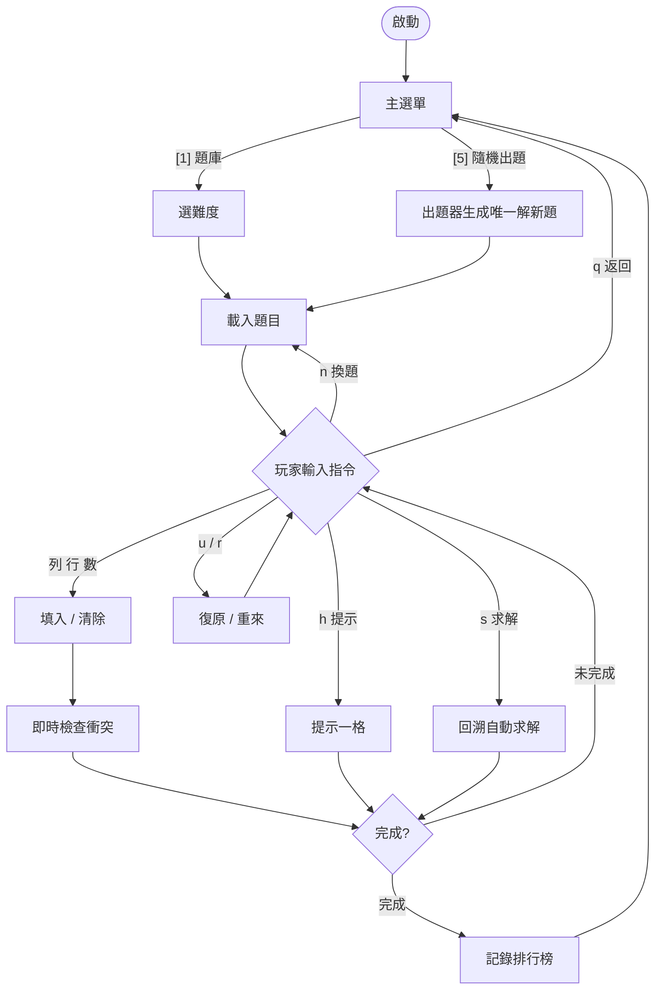
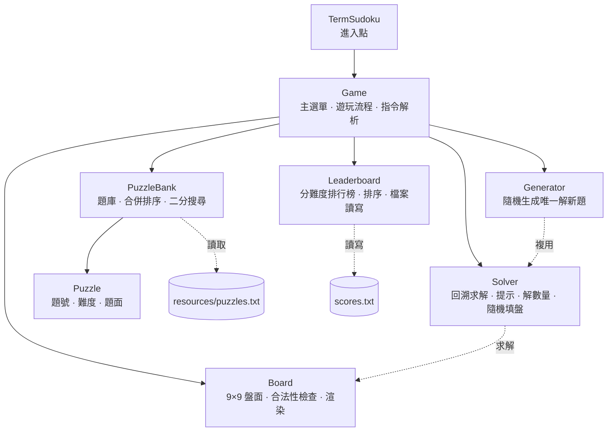
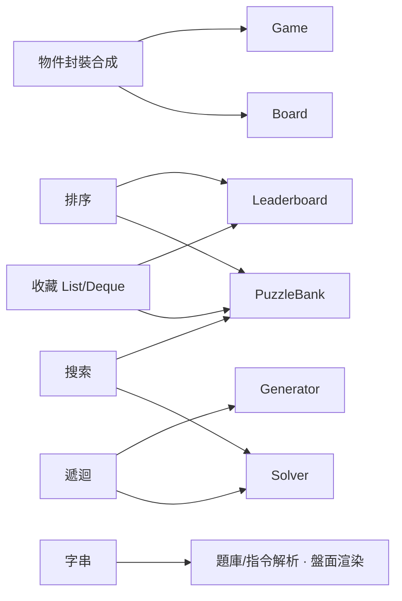

# 終端數獨 TermSudoku

文字介面（終端機）數獨遊戲，以 Java 實作。可載入題庫遊玩、即時檢查衝突、提示一格、以回溯法（backtracking）自動求解、由程式隨機生成保證唯一解的新題，並記錄分難度完成排行榜。

淡江大學資訊管理學系 — Java 程式設計　期末分組作品（G907）

組員：李佳勳（學號：414631225） ／ 黃建瑋（學號：414630326） ／ 陳曼婷（學號：414630086）

## 執行方式

需求：JDK 17 以上（開發環境為 JDK 25）。請在專案根目錄執行，程式會讀取 `resources/puzzles.txt`（找不到時改用內建題目）。

命令列：

```bash
javac -encoding UTF-8 -d out src/*.java
java -cp out TermSudoku
```

NetBeans（本專案已是 NetBeans 專案）：`File → Open Project`，選此資料夾，按 `Run`（F6）即可執行，主類別為 `TermSudoku`。

## 主選單

| 選項 | 功能 |
|---|---|
| `[1]` | 開始新遊戲（選難度，從題庫隨機挑一題） |
| `[2]` | 從題庫選題遊玩 |
| `[3]` | 自動求解示範（觀看回溯解題） |
| `[4]` | 難度排行榜（簡單／普通／困難分開） |
| `[5]` | 隨機出新題並遊玩（程式生成保證唯一解） |
| `[0]` | 離開 |

## 隨機出題器（程式生成唯一解）

選項 `[5]` 不從固定題庫取題，而是即時生成一道全新題目，演算法如下（流程圖見 [`docs/出題器流程圖.svg`](docs/出題器流程圖.svg)）：

1. `Solver.fillRandom` 以回溯遞迴填出一個完整解盤，候選 1-9 隨機洗牌，每次得到不同解盤。
2. 把 81 格隨機打亂後逐格嘗試挖空。
3. 每挖一格，用 `Solver.countSolutions(board, 2)` 計算解數：仍為唯一解（==1）就接受挖空，變多解（>1）就還原該格。
4. 挖到剩餘提示數達難度目標（簡單 36／普通 30／困難 26）為止。

每挖一格後的唯一解檢查，保證產出的題目恰有一個正解，與提示 `h`、自動求解 `s` 完全相容。

## 操作說明（遊戲中）

| 指令 | 作用 | 範例 |
|---|---|---|
| `列 行 數` | 在第「列」列、第「行」行填入數字 1-9 | `3 5 7` |
| `列 行 0` | 清除該格 | `3 5 0` |
| `h` | 提示一格（由求解器給出正確數字） | `h` |
| `s` | 自動求解（觀看回溯解題） | `s` |
| `u` | 復原上一步 | `u` |
| `r` | 重來本題（清空已填，保留題目給定） | `r` |
| `n` | 換一題（同難度隨機） | `n` |
| `?` | 顯示指令說明 | `?` |
| `q` | 返回主選單 | `q` |

數字可用全形或半形，分隔可用空白或逗號。

## 遊玩流程



## 專案結構

模組合成關係（`Game` 組合各模組，體現物件合成）：



```
src/TermSudoku.java   進入點
src/Game.java         主選單與遊玩流程（合成各模組、字串指令解析）
src/Board.java        9×9 盤面（封裝、合法性檢查、盤面渲染）
src/Solver.java       回溯遞迴求解、計算解數量、提示一格、隨機填盤（出題器用）
src/Generator.java    隨機出題器（生成解盤、逐格挖洞、唯一解驗證）
src/Puzzle.java       一道題目（題號／難度／題面）
src/PuzzleBank.java   題庫（收藏、合併排序、二分搜尋）
src/Leaderboard.java  分難度排行榜（收藏、排序、檔案讀寫、日期與提示次數）
resources/puzzles.txt 題庫（每行格式： 難度|81字元題面|名稱）
```

## 對應本學期主題

主題對應到的模組（圖示總覽，明細見下表）：



| 主題 | 在哪裡實作 |
|---|---|
| 物件封裝合成 | `Board`／`Puzzle` 的私有欄位；`Game` 組合 `Solver`／`PuzzleBank`／`Generator`／`Leaderboard` |
| 收藏 | `PuzzleBank`、`Leaderboard` 的 `List`；復原步驟用 `Deque` |
| 字串 | 題庫行解析、指令解析、盤面渲染、題面序列化（出題器） |
| 遞迴 | `Solver` 回溯求解、`countSolutions`、出題器 `fillRandom`、`PuzzleBank` 合併排序 |
| 搜索 | 取難度題走 `firstByLevel` 二分搜尋、`byId` 線性搜尋、回溯搜索 |
| 排序 | 合併排序（依難度）、排行榜依用時排序 |
